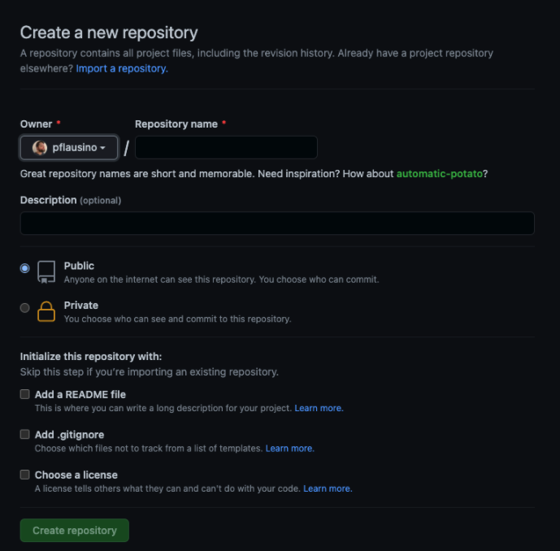
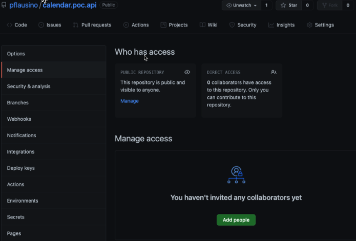

## Geral 😏

Este desafio tem por objetivo avaliar dois cenários. No caso de um desenvolvedor proficiente na linguagem e framework, ele deve mostrar esse domínio fazendo uso das **Tecnologias Obrigatórias e** **Tecnologias Sugeridas** conforme tiver conhecimento ou tempo.

Já para programadores que não tem domínio da Stack, deve se atentar a cumprir o proposto, fazendo uso das **Tecnologias Obrigatórias,** mas nada impede de se arriscar nas **Tecnologias Sugeridas** (só cuidado para não se perder .. keep simple 😉 ).

## Desafio 👻

O desafio consiste em construir uma REST API na Stack C#/.NET que seja capaz de realizar os  requisitos descritos a baixo

Não é necessário fazer um cliente(Front-End), basta o retorno da REST API no formato JSON

**Requisito 1 - Cadastro de Membros**

O sistema deve cadastrar os membros de uma igreja, guardando no mínimo os campos (Name (string), IsBaptized(boolean), Address(string/object), BirthdayDate(date), BaptismDate(Date)  )

Deve ser possível **Cadastrar(POST), Deletar(DELETE), Atualizar(PUT) e Buscar pelo ID (GET)**

Opcional: Criar uma busca que passando um fragmento do nome, retorne possíveis resultados 

**Requisito 2 - Relatório da Igreja**

O sistema deve retornar um relatório sobre os membros da igreja com no mínimo as seguintes informações (MemberTotal(total de membros da igreja(int)), TotalBaptizedMembers(total de membros batizados(int), OldestMember(Nome do membro mais velho(string)), OldestMemberAge(Idade do membro mais velho(int)), MostRecentBaptism(Data do batismo mais recente (Date))

Opcional: Criar um segundo relatório que liste todos os membro batizados, calcule os dias que faltam para o seu aniversário, e ordene pelo membro com o aniversário mais próximo

## Tecnologias Obrigatórias 📜

- REST API
- .NET 5 / C#
- Um Banco de dados (SQL Server, Mysql, Mongo, Redis, MariaDB, PostgreSQL )
- Git

## Tecnologias Sugeridas 📎

- Um ORM (Nhibernate, Entity Framework, Dapper)
- Docker/Docker Compose
- CQRS
- AutoMapper
- Microsserviços (Dica: você pode pensar no Membro como um Domínio e no relatório como outro)
- Testes Unitários (XUnit, NUnit, MSTest)
- API Publicada em um Serviço (Sugestão Free: Heroku/Mongo DB Atlas)
- GitHub Actions (Build, Deploy, Publish com webHook)
- Swagger
- Health Checks
- Message Queue
- Cache

Não deixe essa lista te limitar, conhece algo diferente e acha que seria interessante? Mostre para nós

Caso queira demostrar seus conhecimentos com Front-End Recomendamos:

- Angular
- Flutter (Mobile)
- React

## Dicas✌️

- Não conseguiu fazer tudo? sem problemas, entregue o que tem.
- Gestão do seu tempo, também é um fator importante
- Nos queremos ver você usando as boas praticas com Git, então, evite commits muito grandes ou diretos na master... talvez pull requests
- Ficou com duvidas de algo? mande um email pra mim em paulo.flausino@iatec.com que logo logo eu respondo
- Crie um arquivo [Readme.md](http://Readme.md) explicando como rodar a sua api e como fazer os testes

## Como Entregar o Desafio ✉️ 

Para entregar esse desafio você deve criar um repositório público no Github 

Apos seu primeiro commit, você deve ir na aba Settings > Manage Access > Add people

Procure o usuario /pflausino e adicione-o para permitir o acesso

